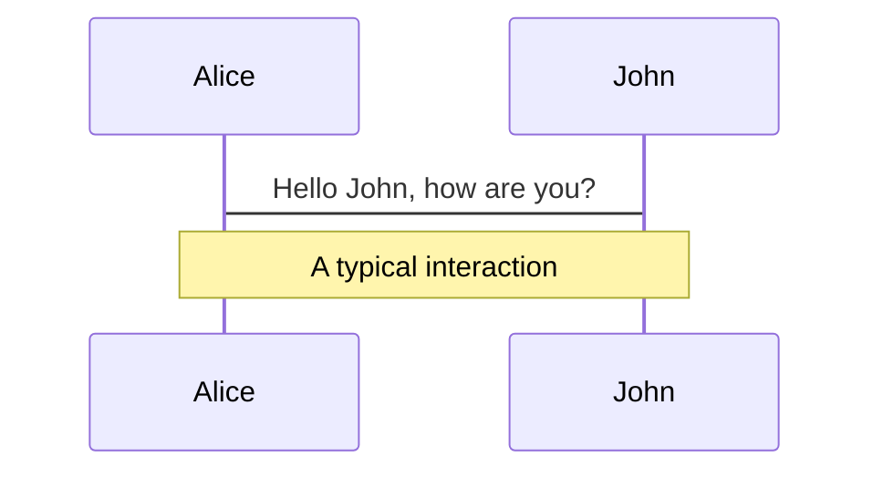
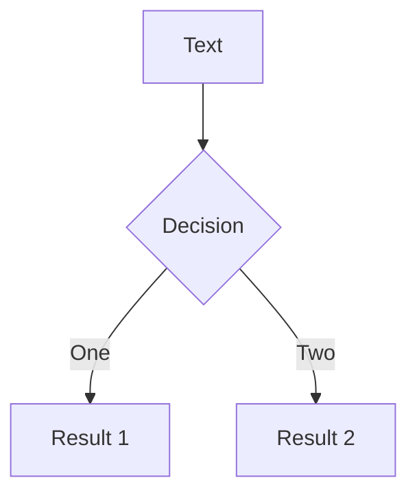
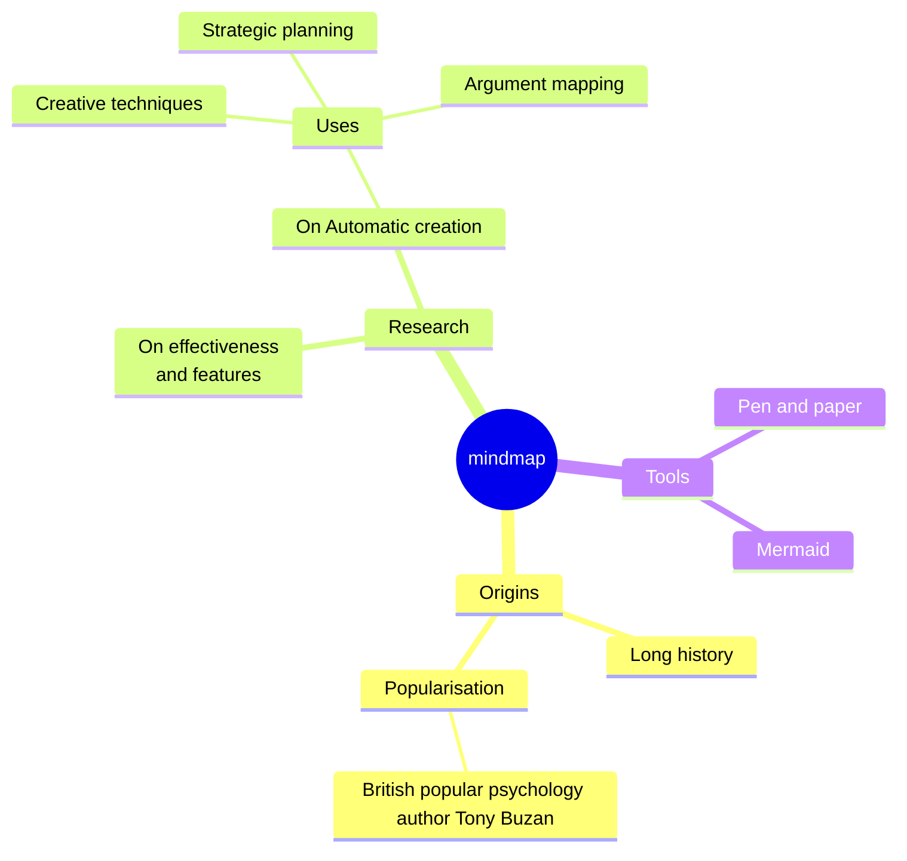
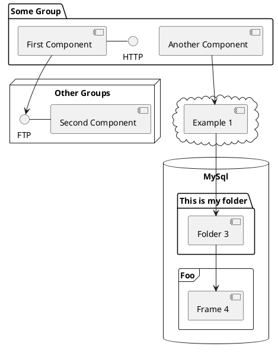

---
# You can also start simply with 'default'
theme: default
# random image from a curated Unsplash collection by Anthony
# like them? see https://unsplash.com/collections/94734566/slidev
background: https://cover.sli.dev
# some information about your slides (markdown enabled)
title: What is WebAssembly
info: |
  ## Slidev Starter Template
  Presentation slides for developers.

  Learn more at [Sli.dev](https://sli.dev)
# apply unocss classes to the current slide
class: text-center
# https://sli.dev/features/drawing
drawings:
  persist: false
# slide transition: https://sli.dev/guide/animations.html#slide-transitions
transition: slide-left
# enable MDC Syntax: https://sli.dev/features/mdc
mdc: true
# take snapshot for each slide in the overview
overviewSnapshots: true
fonts:
  sans: Verdana
  mono: Fira Code
---

# Introduction to WebAssembly

A hacked together introduction to WASM concepts and programming

<!--
The last comment block of each slide will be treated as slide notes. It will be visible and editable in Presenter Mode along with the slide. [Read more in the docs](https://sli.dev/guide/syntax.html#notes)
-->

---

# Origins of WebAssembly (WASM)

- First appeared 2017
- First release 2019

According to the WebAssembly specification:

> ... Its main goal is to enable high performance **applications on the Web,**

but then also

> ... but it does not make any Web-specific assumptions or provide Web-specific
> features, so it can be employed in **other environments** as well.

<!--
You can have `style` tag in markdown to override the style for the current page.
Learn more: https://sli.dev/features/slide-scope-style
-->

<style>
/*h1 {
  background-color: #2B90B6;
  background-image: linear-gradient(45deg, #4EC5D4 10%, #146b8c 20%);
  background-size: 100%;
  -webkit-background-clip: text;
  -moz-background-clip: text;
  -webkit-text-fill-color: transparent;
  -moz-text-fill-color: transparent;
}*/
</style>

---

# Example with Emscripten/C (1)

For this example, a very simple C function was compiled to WASM using the 
Emscripten SDK. The code is very simple:

```c
#include <emscripten.h>

EMSCRIPTEN_KEEPALIVE
int my_add(int a, int b) {
    return a + b;
}
```

This code almost looks like regular C with the exception of the 
`EMSCRIPTEN_KEEPALIVE` macro and the special `#include`.

---

# Example with Emscripten/C (2)

To get this example built, the command line looks almost identical to calling another C/C++
compiler, like `gcc` or `clang`:

```bash
emcc 02_intro.c -o build/02_intro.js
```

The actual call has a couple of additional parameters that are needed, to make sure that the
single function in our `.c` file is not optimized away and that we also get the JS-function
`cwrap` which we need to create a wrapper around the C-function for easier use with Javascript.

---

# Example with Emscripten/C (3)

Notice that we ask `emcc` to generate a JS source file (`-o build/02_intro.js`). Emscripten however
will also generate the `.wasm` file. The JS file contains helper functions to simplify the
interaction between Javascript and the C/C++\-based WASM module. More of that will be explained
later.

---
layout: iframe-right
url: http://localhost:8000/02_zz_cpp_example.html
---

# Example with Emscripten/C (4)

Now we just need to include this in our website

```html
<script src="build/02_intro.js"></script>
```

... load the WASM module from Javascript ...

```javascript
Module.onRuntimeInitialized = _ => {
  my_add = Module.cwrap('my_add', 'number',
                        ['number', 'number']);
}
```

... and then just call it as a Javascript function

```javascript
let result = my_add(100, 20);
```

---
layout: iframe
url: http://localhost:8000/build/03_bigger_example.html
---
# Complex Emscripten example

---

# Basic concepts

At the very bottom, WebAssembly defines a very simple **Virtual Machine**. 

* Stack-based instruction set (i32/i64, f32/f64)
* Linear memory
    * single, 32-bit memory space 
        * proposal for up to 64 bit
        * proposal for multiple memories
* Interface defined through WASM modules
    * function signature types
    * imports and exports
    * global variables
    * tables

---

# WASM == JVM++? Or JVM-\-? 😜

| | **WASM** | **JVM** |
|-|------|-----|
| **Instructions** | ALU, control flow, memory access, table operations | ALU, control flow, object access and manipulation, special calls |
| **Data types** | `i32`, `i64`, `f32`, `f64`, `v128`, func references, extern opaque references | integer, long, short, byte, char, float, double, object references |
| **Interfacing** | Module, globals, memory imports/exports | JVM builtins, JNI |

---

# Baremetal WebAssembly Example

For a better understanding of what actually happens under the hood, it is helpful to look at an
example in "plain webassembly". Using the ****wabt** toolchain we can also write WASM modules using
a textual representation of the WebAssembly "assembler language" that is structured like Lisp
programms.

<!-- I'm just cheating a little here, this is actually WAT-code, but Shiki has no formatter
for this. So we just use clojure that also uses s-expressions -->
```clojure
(module
  (func (export "wat_add") (param i32 i32) (result i32)
    local.get 0
    local.get 1
    i32.add))
```

---
transition: fade-out
level: 2
---

# Languages compiling to WASM

A growing list of languages provides WASM targets:

stable(?):

- [C++ Emscripten](https://emscripten.org/index.html), [Rust](https://rustwasm.github.io/book/)
- [TinyGo, a Go variant](https://github.com/tinygo-org/tinygo) targetting a wide range of embedded devices, desktop OSes and WASM
- [Zig](https://ziglang.org/documentation/master/#WebAssembly) targetting various freestanding and OS-based targets as well as WASM
- C#, Python, Swift, TypeScript, Scala, Kotlin, ... (see some details in the [Fermyon project](https://developer.fermyon.com/wasm-languages/webassembly-language-support))

in development:
- [Grain](https://grain-lang.org/)
- [Virgil](https://github.com/titzer/virgil) targetting X86 MacOS, Linux, JAR files and WASM
- [MoonBit](https://www.moonbitlang.com/)

more:
[GitHub - awesome-wasm-langs](https://github.com/appcypher/awesome-wasm-langs)

---

# WASM for plugins

[Extism](https://extism.org/)

---

# Components

<div grid="~ cols-2 gap-4">
<div>

You can use Vue components directly inside your slides.

We have provided a few built-in components like `<Tweet/>` and `<Youtube/>` that you can use directly. And adding your custom components is also super easy.

```html
<Counter :count="10" />
```

<!-- ./components/Counter.vue -->
<Counter :count="10" m="t-4" />

Check out [the guides](https://sli.dev/builtin/components.html) for more.

</div>
<div>

```html
<Tweet id="1390115482657726468" />
```

<Tweet id="1390115482657726468" scale="0.65" />

</div>
</div>

<!--
Presenter note with **bold**, *italic*, and ~~striked~~ text.

Also, HTML elements are valid:
<div class="flex w-full">
  <span style="flex-grow: 1;">Left content</span>
  <span>Right content</span>
</div>
-->

---
class: px-20
---

# Themes

Slidev comes with powerful theming support. Themes can provide styles, layouts, components, or even configurations for tools. Switching between themes by just **one edit** in your frontmatter:

<div grid="~ cols-2 gap-2" m="t-2">

```yaml
---
theme: default
---
```

```yaml
---
theme: seriph
---
```


</div>

Read more about [How to use a theme](https://sli.dev/guide/theme-addon#use-theme) and
check out the [Awesome Themes Gallery](https://sli.dev/resources/theme-gallery).

---

# Clicks Animations

You can add `v-click` to elements to add a click animation.

<div v-click>

This shows up when you click the slide:

```html
<div v-click>This shows up when you click the slide.</div>
```

</div>

<br>

<v-click>

The <span v-mark.red="3"><code>v-mark</code> directive</span>
also allows you to add
<span v-mark.circle.orange="4">inline marks</span>
, powered by [Rough Notation](https://roughnotation.com/):

```html
<span v-mark.underline.orange>inline markers</span>
```

</v-click>

<div mt-20 v-click>

[Learn more](https://sli.dev/guide/animations#click-animation)

</div>

---

# Motions

Motion animations are powered by [@vueuse/motion](https://motion.vueuse.org/), triggered by `v-motion` directive.

```html
<div
  v-motion
  :initial="{ x: -80 }"
  :enter="{ x: 0 }"
  :click-3="{ x: 80 }"
  :leave="{ x: 1000 }"
>
  Slidev
</div>
```

<div class="w-60 relative">
  <div class="relative w-40 h-40">
    
    
    
  </div>

  <div
    class="text-5xl absolute top-14 left-40 text-[#2B90B6] -z-1"
    v-motion
    :initial="{ x: -80, opacity: 0}"
    :enter="{ x: 0, opacity: 1, transition: { delay: 2000, duration: 1000 } }">
    Slidev
  </div>
</div>

<!-- vue script setup scripts can be directly used in markdown, and will only affects current page -->
<script setup lang="ts">
const final = {
  x: 0,
  y: 0,
  rotate: 0,
  scale: 1,
  transition: {
    type: 'spring',
    damping: 10,
    stiffness: 20,
    mass: 2
  }
}
</script>

<div
  v-motion
  :initial="{ x:35, y: 30, opacity: 0}"
  :enter="{ y: 0, opacity: 1, transition: { delay: 3500 } }">

[Learn more](https://sli.dev/guide/animations.html#motion)

</div>

---

# LaTeX

LaTeX is supported out-of-box. Powered by [KaTeX](https://katex.org/).

<div h-3 />

Inline $\sqrt{3x-1}+(1+x)^2$

Block
$$ {1|3|all}
\begin{aligned}
\nabla \cdot \vec{E} &= \frac{\rho}{\varepsilon_0} \\
\nabla \cdot \vec{B} &= 0 \\
\nabla \times \vec{E} &= -\frac{\partial\vec{B}}{\partial t} \\
\nabla \times \vec{B} &= \mu_0\vec{J} + \mu_0\varepsilon_0\frac{\partial\vec{E}}{\partial t}
\end{aligned}
$$

[Learn more](https://sli.dev/features/latex)

---

# Diagrams

You can create diagrams / graphs from textual descriptions, directly in your Markdown.

<div class="grid grid-cols-4 gap-5 pt-4 -mb-6">









</div>

Learn more: [Mermaid Diagrams](https://sli.dev/features/mermaid) and [PlantUML Diagrams](https://sli.dev/features/plantuml)

---
foo: bar
dragPos:
  square: 654,22,167,_,-16
---

# Draggable Elements

Double-click on the draggable elements to edit their positions.

<br>

###### Directive Usage

```md

```

<br>

###### Component Usage

```md
<v-drag text-3xl>
  <carbon:arrow-up />
  Use the `v-drag` component to have a draggable container!
</v-drag>
```

<v-drag pos="663,206,261,_,-15">
  <div text-center text-3xl border border-main rounded>
    Double-click me!
  </div>
</v-drag>


###### Draggable Arrow

```md
<v-drag-arrow two-way />
```

<v-drag-arrow pos="537,365,-194,58" two-way op70 />

---
src: ./pages/imported-slides.md
hide: false
---

---

# Monaco Editor

Slidev provides built-in Monaco Editor support.

Add `{monaco}` to the code block to turn it into an editor:

```ts {monaco}
import { ref } from 'vue'
import { emptyArray } from './external'

const arr = ref(emptyArray(10))
```

Use `{monaco-run}` to create an editor that can execute the code directly in the slide:

```ts {monaco-run}
import { version } from 'vue'
import { emptyArray, sayHello } from './external'

sayHello()
console.log(`vue ${version}`)
console.log(emptyArray<number>(10).reduce(fib => [...fib, fib.at(-1)! + fib.at(-2)!], [1, 1]))
```

---
layout: center
class: text-center
---

# Learn More

[Documentation](https://sli.dev) · [GitHub](https://github.com/slidevjs/slidev) · [Showcases](https://sli.dev/resources/showcases)

<PoweredBySlidev mt-10 />
